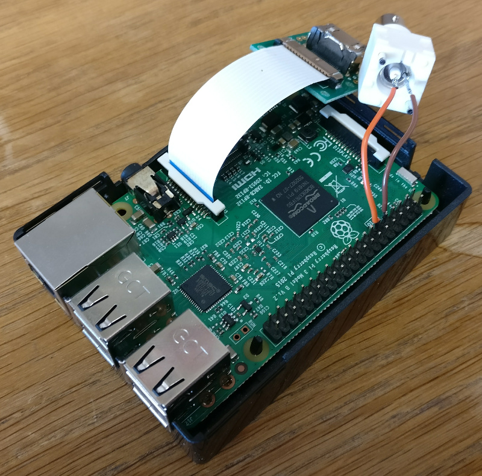

.. _raspberryPiSetup:

==================================================
Raspberry Pi tracking and related networking setup
==================================================

Setting up Raspberry Pi with camera for tracking
================================================

This tutorial is based on setting up `Raspberry Pi 3 Model B <https://www.raspberrypi.org/products/raspberry-pi-3-model-b/>`_ with `Camera Module V2 <https://www.raspberrypi.org/products/camera-module-v2/>`_.

Assembling Raspberry Pi Camera Module and Coaxial Cable Plug
------------------------------------------------------------

The Raspberry Pi (RPi) Camera Module is usually bought and fitted separately to the RPi board. The Coaxial Cable Plug is necessary to send signals to the Open Ephys Acquisition Board each time a frame is captured.

Preferably the camera should be used with HDMI cable extension sold on `Pimoroni website <https://shop.pimoroni.com/products/pi-camera-hdmi-cable-extension>`_. This allows the camera to be positioned distant from the RPi and the angle manipulated more comfortably. Instructions for its assembly should be available from the provider.

Regardless of whether the HDMI cable extension is used or not, a board with the flat camera cable attached will need to be assembled to the RPi board. Attach the flat cable to the interface right next to the HDMI output. Look at the interface and make sure the metal contacts on the cable touch the metal contact on the RPi interface. See image below. Push down on the clip on the interface to mechanically secure the connection.

The Standard Coaxial Cable plug can be soldered to the RPi GPIO Pinout. See the above image. On Raspberry Pi 3 Model B the Ground from the Coaxial plug should be soldered on the 5th pin on the 2nd row and the Other contact from the Coaxial plug to the 6th pin in the same row. That is if rows and pins are counted from the RPi corner diagonal from the LAN port.

More clearly, the Ground from Coaxial plug must be soldered to any of the **Ground pins** on RPi and the other contact from the Coaxial plug must be soldered to **Physical pin 11**. If a different Physical pin is used than nr 11, then changes should be made in the tracking script (tracking.py, ttlPin variable). To identify the identity of each pin, use the https://pinout.xyz/ information.

.. _installingRaspbian:

Installing Raspberry Pi OS: Raspbian
------------------------------------

Download **Raspbian Jessie With Pixel** (Here used version 4.4) from `Raspberry website <ttps://www.raspberrypi.org/downloads/raspbian/>`_. Unpack the downloaded *.zip* file with ``Archive Manager`` to get access to the *.img* file.

Download **Etcher** from this `website <https://etcher.io/>`_. Unpack the downloaded *.zip* and run (double-click) the Etcher *.AppImage*. Select the Raspbian *.img* file and your inserted microSD card. Write the image (*Flash* button).

Insert the microSD card into Raspberry Pi.

Install necessary libraries on Raspberry Pi
-------------------------------------------

Connect to RPi a keyboard, mouse and monitor.

This tutorial instructs you to connect the RPi to the internet using the same network connection as is used for your recording PC, if you used the following method to set it up: :ref:`RecPCnetworkInterfaces`. This means you will not be able to use the Recording PC to access the internet, while you work through the part "Install necessary libraries on Raspberry Pi". If you can use another means of achieving network connection on the RPi, you can ignore steps in this part relating to **interfaces** file. Otherwise, connect the RPi to the network with the same ethernet cable as you were so far using on the Recording PC.

Add :download:`this script (install-opencv.sh) <../RecordingPCsetup/install-opencv.sh>` and the file ``/etc/network/interfaces`` (as set up on the Recording PC in this guide: :ref:`RecPCnetworkInterfaces`) to the RPi *Home folder* with a USB stick.

You may need to edit the ``interfaces`` file in your RPi home folder. Run the terminal command ``ifconfig`` on the RPi and make a note of the first device on the list. Devices are aligned to the left column. This is likely ``eth0``. Replace the device name ``enp2s0`` in the ``interfaces file`` with the device you saw in ``ifconfig`` output. You can use a simple text editor by double clicking on the ``interfaces`` file in your home folder, making the changes and saving it.

Apply the newly created ``interfaces`` file in the Raspberry Pi with terminal commands:

.. code-block:: none

	sudo mv /etc/network/interfaces /etc/network/interfaces_old        # Makes a copy of the original version
	sudo mv ~/interfaces /etc/network/interfaces       # Replaces the previous interfaces file

Reboot the Raspberry Pi for network changes to take effect.

Now update the RPi with terminal commands:

.. code-block:: none

	sudo apt-get update        # Fetches the list of available updates
	sudo apt-get upgrade       # Strictly upgrades the current packages
	sudo apt-get dist-upgrade  # Installs updates (new ones)

Install OpenCV using the ``install-opencv.sh`` script. Right click on ``install-opencv.sh`` and select Properties. Open Permissions tab and make sure all three Access Control settings (View content, Change content, Exectue) are set to Anyone. Click OK to close the window. Now run the script using terminal command ``./install-opencv.sh``.

To install use the following terminal commands, as copied from https://github.com/MonsieurV/ZeroMQ-RPi

.. code-block:: none

	sudo apt-get install libtool pkg-config build-essential autoconf automake
	wget https://github.com/jedisct1/libsodium/releases/download/1.0.3/libsodium-1.0.3.tar.gz
	tar -zxvf libsodium-1.0.3.tar.gz
	cd libsodium-1.0.3/
	./configure
	make
	sudo make install
	cd ~/
	wget http://download.zeromq.org/zeromq-4.1.3.tar.gz
	tar -zxvf zeromq-4.1.3.tar.gz
	cd zeromq-4.1.3/
	./configure
	make
	cd ~/
	sudo make install
	sudo ldconfig
	sudo apt-get install python-dev
	sudo pip install pyzmq

Install packages necessary to run the tracking and calibration scripts

.. code-block:: none

	sudo apt-get install python-scipy

Camera needs to be enabled in RPi settings. You can do this by accessing RPi settings via terminal command ``sudo raspi-config`` and choosing *Interfacing Options* with arrow keys and pressing Enter. Select *Camera* option and choose to *Enable* it. Reboot the RPi.

Now the RPi is ready to use the tracking scripts. 

Setting up Raspberry Pi networking with recording PC
====================================================

This part describes setting up networking between the recording PC and one or multiple Raspberry Pis. This setup is based on having two network adapters on the Recording PC. One of them connected to the internet, as in this guide: :ref:`RecPCnetworkInterfaces`. The other can be a USB network adapter or a PCIe card that is then connected to the RPi or to a network switch that has multiple RPis connected to it. (Ubuntu should recognise and automatically install any necessary drivers for a network adapter. This can be verified if a new device shows up in ``ifconfig``) When connecting multiple RPis, the setup is identical, only that each RPi has a different static IP address assigned (see below on how to change ``dhcpcd.conf``).

Configuring Raspberry Pi
------------------------

SSH needs to be enabled. You can do this by accessing RPi settings via terminal command ``sudo raspi-config`` and choosing *Interfacing Options* with arrow keys and pressing Enter. Select *SSH* option and choose to *Enable* it. Reboot Raspberry Pi.

Restore the original interfaces file with the following commands

.. code-block:: none

	sudo mv /etc/network/interfaces /etc/network/interfaces_MainLine
	sudo mv /etc/network/interfaces_old /etc/network/interfaces

To set up a static IP address, you will need to edit the ``dhcpcd.conf``. You can do this with the following terminal command ``sudo leafpad /etc/dhcpcd.conf``. Add the following lines to the end of this file and Save it.

.. code-block:: none

	# Static IP for connection to Recording PC
	interface eth0
	static ip_address=10.0.0.20/24
	static routers=10.0.0.1
	static domain_name_servers=10.0.0.1

Here again the ``interface`` variable is set to ``eth0``. This is likely the primary ethernet adapter identity on your RPi, but you can check this using the ``ifconfig`` terminal command. The first value on the left column should be used as the ``interface`` value in ``dhcpcd.conf``.

Note that if you have multiple RPis connected to the Recording PC through a switch, they should have different ``static ip_address`` values in the ``dhcpcd.conf``. These could be for example ``10.0.0.20/24`` and ``10.0.0.21/24``. **Make a note of the IP entered on each RPi, as you will need these to connect to RPi from the Recroding PC.**

The ``interfaces`` file will also need to be slightly edited. Open it using the terminal command ``sudo leafpad /etc/network/interfaces``. Find the line that says ``iface eth0 inet manual``, or whatever the correct primary network adapter identity is. Put a ``#`` in front of that line, commenting it out. Just below the line add a new line: ``auto eth0`` or whatever the correct primary network adapter identity is. Save the file. So the two edited lines in the file would look like this:

.. code-block:: none

	# iface eth0 inet manual
	auto eth0

With this setup the SSH login may be slow. This can be fixed by editing the ``sshd_config`` file. Open it with terminal command ``sudo leafpad /etc/ssh/sshd_config`` and add this line to the very end:

.. code-block:: none

	UseDNS no

Now after you restart the RPi, it should be ready for connecting to the Recording PC and to be used with the Recording Manager.

Configuring the Recording PC
----------------------------

These instructions are based on `this blog post <https://www.thomas-krenn.com/en/wiki/Two_Default_Gateways_on_One_System>`_.

Changes need to be made to the ``interfaces`` file. Open this using terminal command ``sudo gedit /etc/network/interfaces``. Add the following lines to the end of the file:

.. code-block:: none

	# Network adapter interfacing with RPis
	allow-hotplug eth1
	iface eth1 inet static
	address 10.0.0.10
	netmask 255.255.255.0
	gateway 10.0.0.1
	dns-nameservers 8.8.8.8
	post-up ip route add 10.0.0.0/24 dev eth1 src 10.0.0.10 table rt2
	post-up ip route add default via 10.0.0.1 dev eth1 table rt2
	post-up ip rule add from 10.0.0.10/32 table rt2
	post-up ip rule add to 10.0.0.10/32 table rt2

Note that the word ``eth1`` occurs 4 times in this block. This needs to be replaced by the identity of the network adapter that is connected to the RPis. You can find the identiy with the terminal command ``ifconfig`` and checking which adapter identiy (left column) appears and disappears as you change as you connect and disconnect the network adapter from the PC. It should be the second on the list.

The ``rt_tables`` file also needs to be edited. Open it with terminal command ``sudo gedit /etc/iproute2/rt_tables``. Add the following line to the very end of the file:

.. code-block:: none

	1 rt2

Now after you restart the Recording PC you should be able to connect to the RPi using the terminal command ``ssh pi@10.0.0.20`` or whatever was your chosen static IP address for the RPi. The first time you do this from the Recording PC, it may say *The authenticity of host '10.0.0.20 (10.0.0.20)' can't be established. -//- Are you sure you want to continue connecting (yes/no)?** Type **yes** and hit Enter. The default password for the RPi is ``raspberry``.

Configure SSH keys to avoid Password requests
---------------------------------------------

This is necessary for the Recording Manager to successfully interact with the RPi. The following steps are based on `this guide <https://www.raspberrypi.org/documentation/remote-access/ssh/passwordless.md>`_.

Generate an SSH key on Recording PC with terminal command ``ssh-keygen -t rsa -C recpc@pi``. Use the default location to save the key by pressing Enter. Leave the passphrase empty by pressing Enter.

Open terminal on Recording PC and enter the connect to your RPi using SSH with command ``ssh pi@10.0.0.20`` and enter ``raspberry`` as password. Enter this command in the terminal where you opened the SSH connection ``install -d -m 700 ~/.ssh``.

Now exit the SSH session or open a new terminal on Recording PC and enter this command ``cat ~/.ssh/id_rsa.pub | ssh pi@10.0.0.20 'cat >> .ssh/authorized_keys'``. Use the correct IP address (the numbers: ``10.0.0.20``) in that command for the IP address of the RPi you are connecting to. Enter the password ``raspberry`` for your RPi.

Now your RPi should be able to connect to the RPi via SSH without a password.

.. _duplicatingRPis:

Making copies of Raspberry Pis
==============================

Once one Raspberry Pi has been set up and configured based on the instructions above, it is best to set the others up as simple copies of the first one. To do this, you can use linux built in method to make a virtual copy of the SD drive on your Recording PC or other computer that has SD card reader and then rewrite it onto a new SD card using **Etcher** as during the initial installation of Raspbian. You will only need to make one change separately for each RPi.

Insert your SD card and find out its identifier in Ubuntu using the terminal command ``sudo fdisk -l``. If you are unsure of which device name (something like ``/dev/mmcblk0``) is your RPi SD card, you can check be removing and re-inserting to establish which drive/card appears and disapperas. Drive/card identifiers can have endings indicating paritions, in this case you may have ``/dev/mmcblk0p0`` and ``/dev/mmcblk0p1``. When using the drive identifier in the commands, leave out the ``p0`` or ``p1`` ending, as you want to copy all partitions on the card.

Before you continue, make sure you have unmounted all partitions of the SD card. Using your correct drive identifier, use the following terminal commands:

.. code-block:: none

	sudo umount /dev/mmcblk0p0
	sudo umount /dev/mmcblk0p1
	sudo umount /dev/mmcblk0

Ensure that your PC has as much free space as your SD cards total capacity, then use the following terminal command to make a virtual copy of the card, where you need to use the correct drive identifier:

.. code-block:: none

	sudo dd if=/dev/mmcblk0 of=~/RPi-SDcard-Copy.img

This should put the virtual copy to your home folder and name it ``RPi-SDcard-Copy.img``. If you wish to save it elsewhere, you can specify the full path including the file name, instead of the ``~/RPi-SDcard-Copy.img`` in the above command.

Now remove the original RPi SD card from the computer and replace it with a new one. You can now proceed to write the newly made copy of the original SD card onto the new SD card using Etcher, as you did at this part of the guide: :ref:`installingRaspbian`. You just need to choose the newly created ``RPi-SDcard-Copy.img`` to write instead of the Raspbian OS *.img* file you used when installing Raspbian originally.

Once the writing is done, you need to access the newly created SD card. You may need to re-insert it to remount it (Always use eject option if possible, before removing SD cards). You need to edit the ``/etc/dhcpcd.conf`` file on the SD card. Navigate to the SD card directory, go to ``etc`` folder. Open terminal in that folder by right clicking into the folder and choosing *Open in Terminal*. Use this command to open the file in text editor `` sudo gedit dhcpcd.conf``. You need to change one of the lines you added to the ``dhcpcd.conf`` file originally when setting up networking for the RPi. Find the line that says ``static ip_address=10.0.0.20/24``. Edit the IP address to what the address you wish the RPi with this SD card would have, e.g. ``static ip_address=10.0.0.21/24``. Save the text file.

You can now remove the SD card (safely with after ejecting in Ubuntu) and simply plug it into a new Raspberry Pi. It should work perfectly as the one before, only you will need to use the newly set IP address to connect to it. Make sure you test if the SSH connection can be established, with terminal command from Recording PC ``ssh pi@10.0.0.21``. At first time of running, it may say *The authenticity of host '10.0.0.21 (10.0.0.21)' can't be established. -//- Are you sure you want to continue connecting (yes/no)?** Type **yes** and hit Enter.