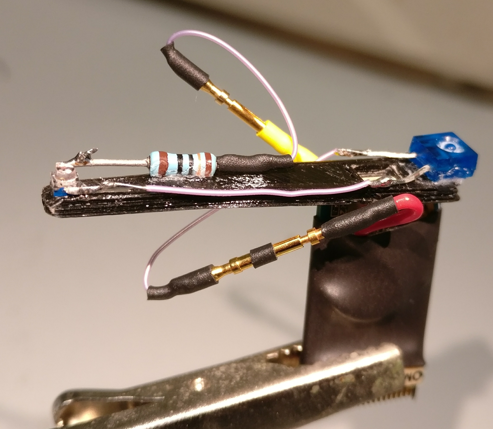
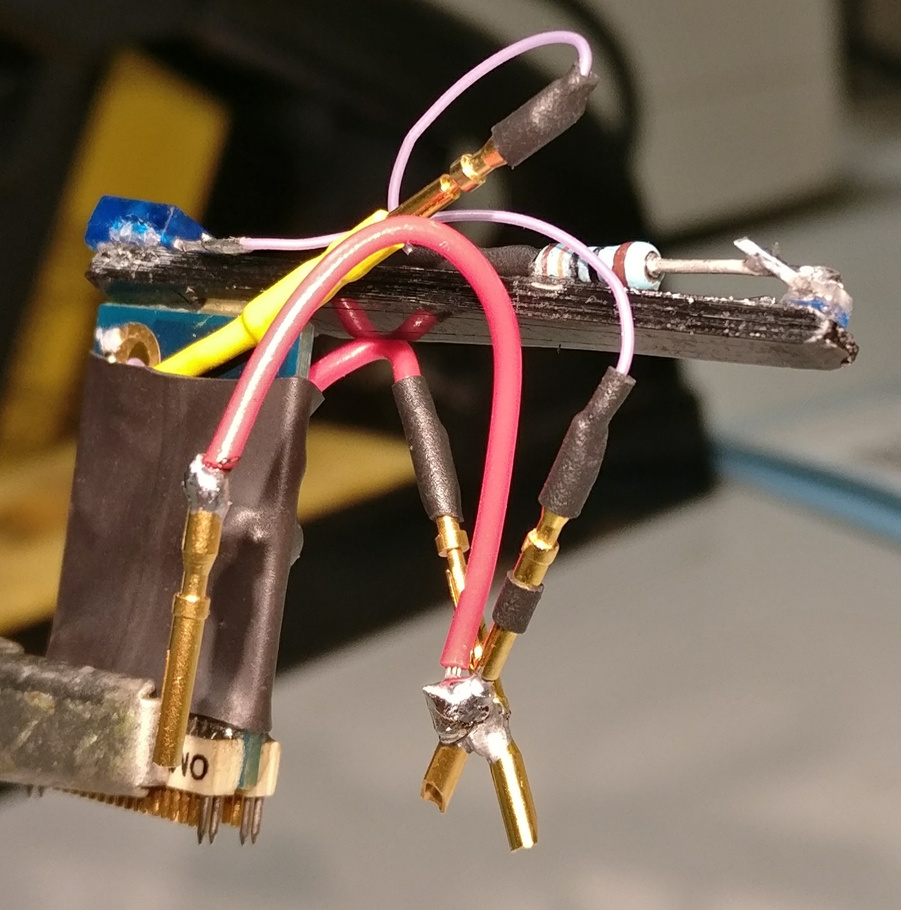

.. _recordingPCandOpenEphysGUI:

=======================================
Recording PC setup for Data Acquisition
=======================================

.. _settingUpTheOperatingSystem:

Setting up the Operating System
===============================

Install Ubuntu
--------------

This document is based on Ubuntu 16.04 LTS installation. Instructions can be found on Ubuntu  `website <https://www.ubuntu.com/download/desktop/install-ubuntu-desktop>`_.

*((During installation agree to using 3rd party repositories))*

*((Make sure you keep the option the ask for password on startup))*

If the PC has multiple hard drives, then Ubuntu may put the boot loader (the thing that starts the Operating System) on a different hard drive than the one where Ubuntu files will be. To have control over this, you will need to use the option that also requires you to set up partitions manually. Preferably you would want to have the boot loader on the same drive as your Ubuntu installation. See below.

During installation you can also manually edit the partition sizes and have a separate partition for the Home folder. To do this, use the *Something else* option when the installation prompt asks how to set up the Disks. Use `this guide <https://askubuntu.com/questions/343268/how-to-use-manual-partitioning-during-installation>`_ for setting up the paritions. Here Primary Type option was used for all partitions and Swap was placed to the end of the drive.

Fix slow shutdown issue
-----------------------

This is an optional step, if this issue occurs with your PC setup. It may happen that after installation shutdown process is very slow, which you would notice as you restart your PC. In this case during shutdown, when you see Ubuntu loading logo, hit F12 on the keyboard. If over the next few minutes check if you see similar error messages to the following:

.. code-block:: none

	ata2.00: exception Emask 0x0 SAct 0x0 SErr 0x0 action 0x6 frozen
	ata2.00: status: { DRDY}
	ata2.00: revalidation failed (errno=-5)

If you see similar error messages, do the following to fix it (It is based on the 2nd solution in `this post <https://askubuntu.com/questions/764568/ubuntu-16-04-hangs-on-shutdown-restart/769972#769972>`_)

Open Dash and search for ``Software and Updates``. Open Software and Updates -> Go to Developr Options -> Tick the box next to where it says *Pre-released updates (xenial-proposed)*. It will promt you to Reload your sources, which you should do. After this :ref:`UpdateTheSystem`. After restarting the computer again, this problem should no longer occur.

This is a temoporary fix. It could be a hardware configuration incompatibility with Ubuntu that will be permanently fixed in a future release.

.. _RecPCnetworkInterfaces:

Connect to the local network
----------------------------

It may be possible to connect to the local network automatically by connecting the PC to a network socket or simply by selecting a WiFi network.

If may be necessary to manually assign network settings. This can be done by editing ``/etc/network/interfaces`` with the terminal command ``sudo gedit /etc/network/interfaces``. An example file will look like this:

.. code-block:: none

	# interfaces(5) file used by ifup(8) and ifdown(8)
	auto lo
	iface lo inet loopback
	auto enp2s0
	iface enp2s0 inet static
	address 128.40.50.165
	netmask 255.255.255.0
	gateway 128.40.50.245
	dns-nameservers 128.40.200.1 128.40.200.2 8.8.4.4 8.8.8.8

You can get the correct values for these numbers from the network administrator. The value `enp2s0` here is the network adapter name. This is usually the first adapter in the output for the terminal commant ``ifconfig``.

.. _UpdateTheSystem:

Update the system
-----------------

Use the terminal commands:

.. code-block:: none

	sudo apt-get update        # Fetches the list of available updates
	sudo apt-get upgrade       # Strictly upgrades the current packages
	sudo apt-get dist-upgrade  # Installs updates (new ones)

This should be done regularly as the machine is being used and especially before any major changes, such as installing new software or drivers.

Install additional drivers
--------------------------

You may be able to get the very latest drivers only from the website of your hardware manufacturer. E.g. for NVIDIA GPU drivers you should go to http://www.nvidia.com/Download/index.aspx?lang=en-us

Installing drivers, especially the latest ones for most up-to-date hardware can be challenging. The easier and minimal step for ensuring you have all necessary drivers available is to use Ubuntu built-in utility. To do this, open **Dash** (Windows start menu equivalent) and type in ``Additional Drivers``. Open the tool that comes up and select the preferred drivers where possible and click `Apply Changes`. 

*((In the case of the PC which this readme is based on, the available NVIDIA driver was version 340.101, while NVIDIA website provided version 340.102. Since the difference is not likely to be so great, I used the Additional Drivers utility to update the graphics drivers.*

.. _otherUsefulSteps:

Other useful steps
==================

Setting up the programs described in this part is not necessary for taking recordings and doing preliminary analysis. However, they can be useful otherwise and following these guidelines should ensure that setting them up doesn't interfere with the recording part of the system.

At the very least, you should install git and map a network drive to which to transfer the data.

Install git for using github
----------------------------

This program is essential for interfacing with github as well as installing some of the programs for using OpenEphys. Install git with terminal command ``sudo apt-get install git``.

Connect to a network drive
--------------------------

Use `this guide <http://ubuntuhandbook.org/index.php/2014/08/map-network-drive-onto-ubuntu-14-04/>`_ to map a network drive permanently.

Here are the steps using as an example a server named QNAP:

.. code-block:: none

	sudo apt-get install cifs-utils	
	sudo mkdir /media/QNAP
	sudo gedit /etc/nsswitch.conf

Find the line looks like:

.. code-block:: none

	hosts:          files mdns4_minimal [NOTFOUND=return] dns

change it into:

.. code-block:: none

	hosts:          files mdns4_minimal [NOTFOUND=return] wins dns

Run below terminal command so that your Ubuntu can resolve Windows computer name on a DHCP network.

.. code-block:: none

	sudo apt-get install libnss-winbind winbind

Reboot Ubuntu

Enter your username and credentials into a text file ``.smbcredentials`` using gedit with terminal command ``gedit ~/.smbcredentials`` as follows:

.. code-block:: none

	username=enter_your_networkdrive_username_here
	password=enter_your_networkdrive_password_here

Now get values for your **gid** and **uid** by typing into terminal ``id enter_your_pc_username_here``. Use these values to edit ``fstab`` file by typing into terminal:

.. code-block:: none

	sudo cp /etc/fstab /etc/fstab_old
	sudo gedit /etc/fstab

Add to the end of this file as a single line the following after modifying it to your configuration:

.. code-block:: none

	//192.168.1.5/share /media/QNAP cifs credentials=/home/enter_your_pc_username_here/.smbcredentials,iocharset=utf8,gid=1000,uid=1000,file_mode=0777,dir_mode=0777 0 0

- 192.168.1.5/data - should be replaced by the IP of your server and the shared folder if applicable.
- /media/QNAP - should be replaced by the folder you created in the beginning of the network mapping tutorial.
- credentials=/home/enter_your_pc_username_here/.smbcredentials - should be modified to include your username.
- **gid** and **uid** values as you found using ``id enter_your_username_here``.

Save the file.

You can now mount the drive with terminal command:

.. code-block:: none

	sudo mount -a

This may need to be run each time you reboot.

Install Google Chrome
---------------------

Download Chrome for Ubuntu from official website. Install by just double-clicking on the file and selecting install in the new window. This may not work, in which case you need to use an alternative Debian package manager, called GDebi. Install this with terminal command ``sudo apt-get install gdebi``. Now right click on the file -> Open With -> GDebi Package Installer. Click on Install button.

You can open Google Chrome from the Dash. It can also be dragged to the side-bar.

Install Sublime Text 3 for editing scripts
------------------------------------------

Download the latest Ubuntu 64 bit version from `Sublime Text website <https://www.sublimetext.com/3>`_. Install by just double-clicking on the file and selecting install in the new window. This may not work, in which case you need to use an alternative Debian package manager, called GDebi. Install this with terminal command ``sudo apt-get install gdebi``. Now right click on the file -> Open With -> GDebi Package Installer. Click on Install button.

Install Sphinx for editing ReadTheDocs files
--------------------------------------------

Instructions are on `Sphinx website <http://www.sphinx-doc.org/en/stable/install.html>`_.

Install using terminal command ``sudo apt-get install python-sphinx``.

- If you have already existing source files for documents you would like to edit, such as this one, you can simply copy the root directory to your PC and skip using ``sphinx-quickstart``.
- If you'd like to start creating brand new documents, then navigate to a folder where you would like to store the documents and run ``sphinx-quickstart`` in terminal. Answer questions with default answers. (Be sure to say yes to the “autodoc” extension.)

In the root directory of your document scripts, run terminal command ``make html`` to update files in Build folder, where you can see the results by opening the ``index.html``.

To use the Sphinx RTD Theme as in these docs, you may need to install it with the following terminal command ``pip install sphinx_rtd_theme``.

Install QT Designer for editing GUIs
------------------------------------

Install Qt4 and Qt4 Designer with the following terminal command:

.. code-block:: none

	sudo apt-get install python-qt4 pyqt4-dev-tools qt4-designer

Now you can edit the *.ui* files with QtDesigner by opening it from Dash, as you search for ``designer``. Within the application you can open existing *.ui* files, edit and save them. You will then have to compile the *.ui* file to a python script using pyuic4. For example, if you had saved your design as ``design.ui``, then you can use the following terminal command in the directory where your file is:

.. code-block:: none

	pyuic4 design.ui -o design.py

With the existing scripts, such as RecordingManager.py, the naming convention for the *.ui* and *.py* files is as in this example.

Turn off screen lock
--------------------

To avoid interference with recordings, you might want to stop Ubuntu from automatically turning off the screen and locking it during periods of inactivity.

Open Dash and type ``Brightness & Lock`` and press Enter. Choose desired settings: e.g. Set "Turn screen off... " setting to Never and un-select "Lock" settings.

Install convenient brightness controller
----------------------------------------

During experiments you may wish to reduce any excess illumination coming from the computer screen(s). Install `Brightness Controller <http://lordamit.github.io/Brightness/>`_ to tune screen brightness from inside Ubuntu, instead of using the monitor controls. To do this, use the following terminal commands:

.. code-block:: none

	sudo add-apt-repository ppa:apandada1/brightness-controller
	sudo apt-get update
	sudo apt-get install brightness-controller

Now you can open Dash and search for Brightness Controller. Click to open the application. To make it easily accessible, right click on it in the Launcher (windows taskbar equivalent) and select *Lock to Launcher*.

Install Open Ephys GUI
======================

Instructions are also on the `Open Ephys website <https://open-ephys.atlassian.net/wiki/display/OEW/Linux>`_. The exact steps I made are as follows:

Install Dependencies
--------------------

OpenEphys plugin-GUI is being developed rapidly, and the latest developmental version maybe better than the used at the time of writing this ReadMe. `This page <https://github.com/open-ephys/plugin-GUI/commit/8d9b08e424f743649ff01e0660a4add817e1f4f1>`_ is for the specific commit used and on which the instructions are based. The instructions should mostly work for later releases as well.

To install the latest version of **plugin-GUI** from `OpenEphys github <https://github.com/open-ephys>`_ run the required scripts in your home folder:

.. code-block:: none

	mkdir Programs
	cd Programs
	mkdir OpenEphysGUI
	cd OpenEphysGUI
	# The below line should give you the latest developmental version
	git clone -b development --single-branch https://github.com/open-ephys/plugin-GUI
	cd plugin-GUI/Resources/Scripts
	sudo ./install_linux_dependencies.sh
	sudo cp 40-open-ephys.rules /etc/udev/rules.d
	sudo service udev restart
	cd ~/

Install More dependencies with terminal commands:

.. code-block:: none

	sudo apt-get install libtool pkg-config build-essential autoconf automake libudev0:i386

Install libsodium with terminal commands:

.. code-block:: none

	git clone git://github.com/jedisct1/libsodium.git
	cd libsodium
	./autogen.sh
	./configure && make check
	sudo make install
	sudo ldconfig
	cd ~/

Install More dependencies with terminal commands:

.. code-block:: none

	sudo apt-get install libxrandr-dev # To fix a compilation error in JUCE library
	sudo apt-get install libzmq3-dev # ZeroMQ version 3 is required
	sudo apt-get install libhdf5-serial-dev # HDF version 1.8.12, or higher, is required

Add the necessary `third-party plugins <https://open-ephys.atlassian.net/wiki/spaces/OEW/pages/47841283/Third-party+plugin+repositories>`_ to the ``~/Programs/OpenEphysGUI/plugin-GUI/Source/Plugins`` folder. The necessary plugins are:

* `VirtualRef <https://github.com/arnefmeyer/VirtualReferencePlugin>`_ (`commit used <https://github.com/arnefmeyer/VirtualReferencePlugin/commit/a8e20cd1df8e0d8003a757391293c75a1089ad7a>`_)
* `CrossingDetector <https://github.com/tne-lab/crossing-detector>`_ (`commit used <https://github.com/tne-lab/crossing-detector/commit/b402d5785d502c2b1cd7ff394d2c93377500cdc6>`_)
* `EventPublisher <https://github.com/arnefmeyer/EventPublisherPlugin>`_ (`commit used <https://github.com/arnefmeyer/EventPublisherPlugin/commit/7d195c9ed3ca75e34885ce3e3e7fdf90a7f24dfa>`_)

Each of the plugins github code contains a folder with the plugin name, e.g. ``VirtualRef`` and files with ``.cpp`` and ``.h`` endings in that folder. Copy that entire folder to plugin-GUI Plugin directory ``~/Programs/OpenEphysGUI/plugin-GUI/Source/Plugins``. As you compile the Open Ephys GUI Plugins following instructions below, these plugins will also be compiled and made accessible in the GUI.

Install Open Ephys
------------------

First you need to add some text to the code that compiles the main GUI  and also the one that compiles the plug-ins. Open the first file with the terminal command ``gedit ~/Programs/OpenEphysGUI/plugin-GUI/Builds/Linux/Makefile``. Find the place in the file, where CPPFLAGS are defined, such as:

.. code-block:: none

	CPPFLAGS := $(DEPFLAGS) -D "LINUX=1" -D "DEBUG=1" -D "_DEBUG=1" -D "JUCER_LINUX_MAKE_7346DA2A=1" -D "JUCE_APP_VERSION=0.4.1" -D

There should be 2 such occurances. They might not be exactly identical to this example, but ``CPPFLAGS :=`` should definitely be there. Add ``-D "JUCE_DISABLE_NATIVE_FILECHOOSERS=1"`` to the list of CPPFLAGS. See the below for an example how the above code was changed:

.. code-block:: none

	CPPFLAGS := $(DEPFLAGS) -D "LINUX=1" -D "JUCE_DISABLE_NATIVE_FILECHOOSERS=1" -D "DEBUG=1" -D "_DEBUG=1" -D "JUCER_LINUX_MAKE_7346DA2A=1" -D "JUCE_APP_VERSION=0.4.1" -D

Save the edited Makefile and then also edit the Makefile.plugins file which you can open with the terminal command ``gedit ~/Programs/OpenEphysGUI/plugin-GUI/Builds/Linux/Makefile.plugins``. Make the same changes.

You are now ready to compile Open Ephys. Do this with the following terminal commands:

.. code-block:: none

	cd ~/Programs/OpenEphysGUI/plugin-GUI/Builds/Linux/
	make
	make -f Makefile.plugins

Create a shortcut for OpenEphys application in the home folder. Use terminal command ``gedit ~/OpenEphysGUI`` to create the file and add these lines to the file to link it to the compiled application:

.. code-block:: none

	#!/bin/bash
	cd ~/Programs/OpenEphysGUI/plugin-GUI/Builds/Linux/build
	./open-ephys

Run this terminal command to make the file executable

.. code-block:: none

	chmod +x ~/OpenEphysGUI

You can now run Open Ephys GUI by opening the terminal (by default it starts in your home folder) and typing in command ``./OpenEphysGUI``.

Intan Headstage setup
=====================

Reference and Ground
--------------------

By default, at least on the 64-channel headstage, the Ground and Reference are not shorted. This can be done manually by soldering a wire between the REF and GND pins on the headstage. This can also be achieved by connecting the two pins on the drive connector.

In case of two headstages connected with an adapter, they also share a Ground and a Reference. Therefore, there is no need to reference both headstages.

Install LEDs on Intan Headstage for tracking
--------------------------------------------

The image below shows an Intan Headstage with an LED bar attached to it. The RED wire is connected to the Ground (note, this should be shorted to Reference), while the YELLOW wire is connected to VDD pin. In case of a 64-channel headstage the VDD can be accessed by soldering the wire to `left side of C1 capacitor <http://intantech.com/images/RHD2164_amp_board_labeled.jpg>`_. The YELLOW wire leads through a 130 Ohm capacitor to a infrared LED. This is in turn connected to another infrared LED with lower luminance, which is then connected to the RED wire. The tracking and processing programs assume the LED with lower luminance rests on the animals head. This is because that one is more likely to be occluded by wires.

The following image show the same LED setup, where an additional wire has been added to the connection between RED wire (Ground-Reference). This can be used to connect Reference channel on the headstage to a Reference Pin on the animal's implant. This is not necessary if the implanted drive's reference is wired to a reference screw in the animal's skull.

.. _RecordingManagerSetup:

Setup Recording PC for using Recording Manager
==============================================

This part describes how to set up the Recording PC to use the custom Python scripts and GUI that interfaces with the Raspberry Pis and handles the Open Ephys data.

Install the dependencies for the scripts
----------------------------------------

Install the necessary packages with the following terminal commands:

.. code-block:: none

	sudo apt-get install python-qt4 python-dev python-pip python-scipy python-pygame
	sudo pip install paramiko
	sudo pip install pyzmq # This assumes you have already installed ZMQ for OpenEphys GUI
	pip install h5py # This assumes you have already installed libhdf5-serial-dev for OpenEphys GUI

Additionally install ``pyqtgraph`` latest version from their website (Here 0.10.0-1 was used). Go to their `website <www.pyqtgraph.org>`_ and download the latest version of Debian/Ubuntu package. Install it by right click on the downloaded *.deb* file -> Open With -> GDebi Package Installer. Click on Install button.

Create folder structure in the home folder with the following terminal commands:

.. code-block:: none

	cd ~/
	mkdir RecordingData
	cd RecordingData
	mkdir RecordingManagerData

Obtain Barry-lab repository ``openEPhys_DACQ`` manually and place them it in your home folder in a folder of the same name, or run the following terminal command:

.. code-block:: none

	cd ~/
	git clone https://github.com/Barry-lab/openEPhys_DACQ

You will need a github.com username and password that has access to the repository.

Make changes in the scripts to suit your PC
-------------------------------------------

Open ``~/openEPhys_DACQ/RecordingManager.py`` with text editor like SublimeText and edit the following lines in the *RecordingManager* class *__init__* function:

.. code-block:: none

	# Set GUI environment
	self.scripts_root = os.path.expanduser('~') + '/openEPhys_DACQ'
	self.pt_root_folder.setPlainText(os.path.expanduser('~') + '/RecordingData')
	self.file_server_path = '/media/qnap/room418'

, such that they would reflect the folder structure on your Recording PC. Note that ``os.path.expanduser('~')`` refers to your Home folder. If you set everything up as instructed in the documentation, nothing but file server path should need changing.

Similarly as you did for the OpenEphysGUI, you can create a shortcut for RecordingManager.py application in the home folder. Use terminal command ``gedit ~/RecordingManager`` to create the file and add these lines to the file:

.. code-block:: none

	#!/bin/bash
	cd ~/openEPhys_DACQ
	python RecordingManager.py

Run this terminal command to make the file executable

.. code-block:: none

	chmod +x ~/RecordingManager

You can now run RecordingManager.py by opening the terminal (by default it starts in your home folder) and typing in command ``./RecordingManager``.

Now the Recording PC is ready to use the Python scripts for managing Open Ephys recordings and Raspberry Pis, if the networking and Raspberry Pis are set up as well. To do this, follow this guide : :ref:`trackingRPiSetup`.