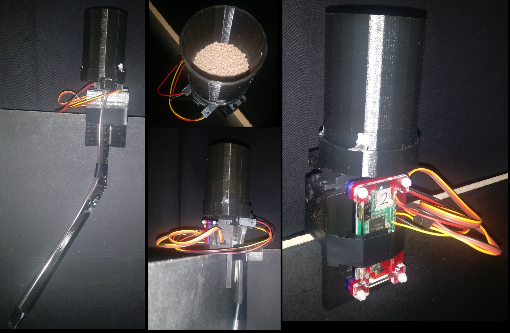
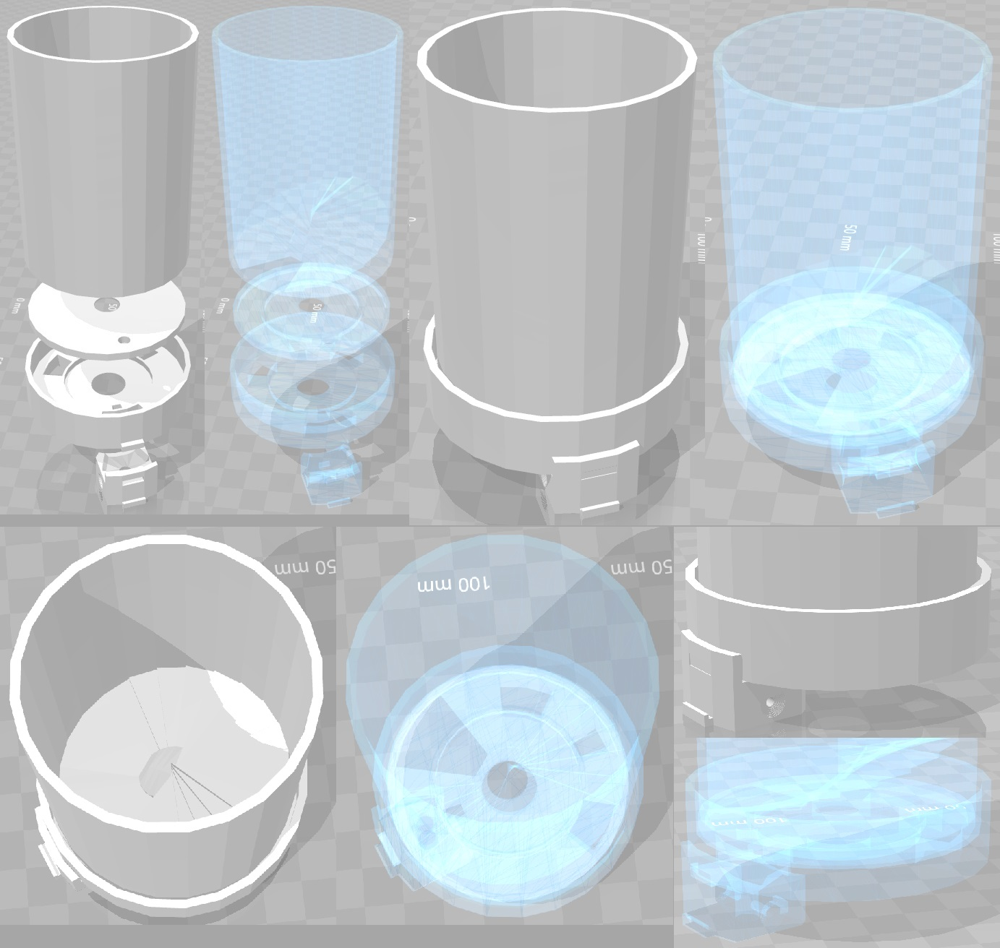

.. _wirelessRewardSetup:

============
FEEDER setup
============

FEEDER - Food Ejector Executing Directions Established via Radio
or Wireless Reward Module.

Setting up Raspberry Pi Zero software
=====================================

The software and networking setup described below is identical for Milk FEEDER and Pellet FEEDER, except for sections where said otherwise.

It is advisable to follow through this part first, before assembling the FEEDER. This way it is more convenient to plug the RPi Zero to the power socket, keyboard, mouse and monitor for working through the following steps.

This tutorial is based on setting up `Raspberry Pi Zero W <https://www.raspberrypi.org/products/raspberry-pi-zero-w/>`_ with Recording PC that is connected to the same WiFi router as the FEEDERs.

If you are setting up multiple Pi Zeros, you can make copies after you have set up the software and networking on the first one. To make copies of a configured RPi Zero, use this guide: :ref:`duplicatingRPis`. Ensure to change the static IP information on each new copy and test the SSH connection for each one, as instructed in the guide.

Installing Raspberry Pi OS: Raspbian
------------------------------------

Download **Raspbian Stretch Lite** (Here used version 4.9) from `Raspberry website <https://www.raspberrypi.org/downloads/raspbian/>`_. Unpack the downloaded *.zip* file with ``Archive Manager`` to get access to the *.img* file.

Download **Etcher** from this `website <https://etcher.io/>`_. Unpack the downloaded *.zip* and run (double-click) the Etcher *.AppImage*. Select the Raspbian *.img* file and your inserted microSD card. Write the image (*Flash* button).

Insert the microSD card into Raspberry Pi Zero.

Install necessary software on RPi Zero
--------------------------------------

Connect your Raspberry Pi Zero W with a keyboard, monitor and power socket. Note, RPi Zero has no regular USB output, therefore you will need to use an adaptor to connect the keyboard. You will also need a mini HDMI to HDMI adaptor to connect your monitor.

The default account on a freshly installed Raspbian OS is username ``pi`` with password ``raspberry``.

You need to connect your RPi Zero to the internet to install the necessary software. This can be done using a Wi-Fi connection, for example, a Wi-Fi hotspot created by your laptop or smartphone.

Raspbian Lite version has only command line interface and no ethernet cable port. Therefore you will need to manually edit ``/etc/wpa_supplicant/wpa_supplicant.conf`` using the command ``sudo nano /etc/wpa_supplicant/wpa_supplicant.conf``. Enter your WiFi details such that the ``wpa_supplicant.conf`` file would look something like this:

.. code-block:: none

	country=GB
	ctrl_interface=DIR=/var/run/wpa_supplicant GROUP=netdev
	update_config=1

	network={
	        ssid="r418"
	        psk="myPasswordIsSafe"
	}

Here ``ssid`` is the name of the wireless network as it would appear in the list of available WiFi devices, in this case ``r418``. The ``psk`` is the access password for the wireless network, in this case ``myPasswordIsSafe``.

To save and exit with the  ``nano`` file editor, press ``Ctrl + X`` and type ``Y`` to confirm save and press ``Enter`` to save to the same file you started to edit.

Reboot the RPi Zero Zero using command ``sudo reboot``.

To update the RPi Zero software with the following terminal commands:

.. code-block:: none

	sudo apt-get update        # Fetches the list of available updates
	sudo apt-get upgrade       # Strictly upgrades the current packages
	sudo apt-get dist-upgrade  # Installs updates (new ones)

To install ZeroMQ use the following terminal commands, as copied from https://github.com/MonsieurV/ZeroMQ-RPi

.. code-block:: none

	sudo apt-get install libtool pkg-config build-essential autoconf automake python-pip
	wget https://github.com/jedisct1/libsodium/releases/download/1.0.3/libsodium-1.0.3.tar.gz
	tar -zxvf libsodium-1.0.3.tar.gz
	cd libsodium-1.0.3/
	./configure
	make
	sudo make install
	cd ~/
	wget http://download.zeromq.org/zeromq-4.1.3.tar.gz
	tar -zxvf zeromq-4.1.3.tar.gz
	cd zeromq-4.1.3/
	./configure
	make
	sudo make install
	sudo ldconfig
	sudo apt-get install python-dev
	sudo pip install pyzmq
	cd ~/

Finally, you need to put the scripts for controlling the feeders onto the RPi Zero. You could copy them over with a USB stick, download them from github or transfer them later using the ``scp`` command. In any case, you need to put the following files from the openEphys_DACQ github to the RPi home directory at ``/home/pi/``:

- Pellet FEEDER
	+ ZMQcomms.py
	+ pelletFeederController.py
- Milk FEEDER
	+ ZMQcomms.py
	+ audioSignalGenerator.py
	+ milkFeederController.py

Setting up Raspberry Pi Zero interface with Picon Zero on Milk FEEDER only
--------------------------------------------------------------------------

I2C module needs to be enabled in RPi settings for use of Picon Zero in the Milk FEEDER. You can do this by accessing RPi settings via terminal command ``sudo raspi-config`` and choosing *Interfacing Options* with arrow keys and pressing Enter. Select *I2C* option and choose to *Enable* it. Reboot the RPi.

Install the necessary libraries for working with the Picon Zero controller with the following terminal commands:

.. code-block:: none

	sudo apt-get install python-smbus python3-smbus python-dev python3-dev
	wget -q http://4tronix.co.uk/piconzero/piconzero.py -O piconzero.py
	# Ensure piconzero.py remains in Pi root directory ``/home/pi/`` as it is used by controller scripts.

You will need to edit the file ``/boot/config.txt``. Do this with terminal command ``sudo nano /boot/config.txt`` and add the following lines to the end of this file:

.. code-block:: none

	dtparam=i2c1=on
	dtparam=i2c_arm=on

Save the file and reboot the RPi Zero.

If you have assembled the RPi Zero with Picon Zero, you are able to test if everything is running smoothly by entering terminal command ``i2cdetect -y 1``. You should see an output table with empty values everywhere but one element, which should say ``22``.

Setting up Raspberry Pi Zero networking with Recording PC
=========================================================

To connect the Recording PC wirelessly to the FEEDERs, use a wireless router. The Recording PC networking for external network is set up using the guide :ref:`RecPCnetworkInterfaces` and the internal networking necessary for tracking Raspberry Pis is set up using the guide  :ref:`RecPCnetworkInterfacesForInternalNetwork`. We add a standard WiFi router (`TL-WR841N <http://www.tp-link.com/uk/products/details/cat-9_TL-WR841N.html>`_) with ethernet LAN ports to the network by connecting the network switch between Recording PC and tracking RPis to one of the ethernet LAN ports on the wireless router.

Note that for the devices to see each other, the IP addresses added to the devices in the internal network must all have the same values, apart from the last digits after the last separator, e.g. ``192.168.0.1`` and ``192.168.0.22``. We chose the ``192.168.0.xx`` address as it did not match the external network IP and made it easiest to work with a WiFi router, for which the default IP address was ``192.168.0.1``.

Setting up the wireless router
------------------------------

The TL-WR841N wireless router configuration page can be accessed using a browser from a connected device (LAN or WiFi) and typing in the address bar ``192.168.0.1``. The username and password are both ``admin``.

We changed the *Wireless Network Name* or ``SSID`` in *Wireless* -> *Wireless Settings* to ``r418``. For the *Wireless Security* we chose *WPA/WPA2 - Personal* version *WPA2-PSK* encryption *AES* and set the Wireless password to our liking.

We also changed the *DHCP* -> *DHCP Settings*, although this may not be relevant. *Start IP Address* to ``192.168.0.1`` and *End IP Address* to ``192.168.0.99``.

Make sure to save any changes and reboot the router.

Setting up Networking with RPi Zero and Recording PC
----------------------------------------------------

Now connect the RPi Zero to the wireless router by changing the file ``/etc/wpa_supplicant/wpa_supplicant.conf`` as instructed above, for connecting RPi Zero to WiFi with internet.

Setting a static IP address on the RPi Zero
-------------------------------------------

The following instructions are based on this `video guide <https://www.youtube.com/watch?v=r3UIQXn8Zp0>`_. 

To set static IP address, you need to make changes to ``/etc/dhcpcd.conf``. For that you need to clarify the identity of the correct wireless device on your RPi Zero. Enter into terminal ``ifconfig`` and you should see network identities. It is most likely ``wlan0`` that has inforamtion such as ``Link encap:Ethernet``. You also need the IP address of the Wi-Fi router. This is the IP address you typed into your browser to find access the router's graphical interface. Alternatively, you can find the router's IP by entering the terminal command ``ip route show``. This should output information on your current connection and should show the Wi-Fi hotspot IP address as something like: ``default via 192.168.0.1``.

Now open ``dhcpcd.conf`` with terminal command ``sudo nano /etc/dhcpcd.conf``. Add to the very end of the file the following lines:

.. code-block:: none

	interface wlan0

	static ip_address=192.168.0.40/24
	static routers=192.168.0.1
	static domain_name_servers=192.168.0.1

Here you want to use the correct device identity that you found on the RPi Zero with ``ifconfig`` command, e.g. ``wlan0``. Set the ``router`` and ``domain_name_server`` values to the IP of the router that you found. Finally, the ``ip_address`` should be the same as the router, only the final value should be different, as in this example it is ``40``. If you have multipe RPi Zeros, set this to different value on each, e.g. 40, 41, 42 etc. The ``/24`` indicates the port number. Keep this the same in all cases.

We used the final IP address values 40 and up for Milk FEEDERs 1, 2, 3 etc and IP address values 60 and up for Pellet FEEDERs 1, 2, 3 etc.

As you save the changes to ``dhcpcd.conf`` and reboot your RPi Zero, it should connect to the Wi-Fi hotspot automatically and have the IP address you assigned. You can check this now with the ``ifconfig`` terminal command on the RPi Zero and check if you see the IP address you assigned. Also try pinging the router by using it's IP in the command ``ping 192.168.0.1``.

Configuring SSH on RPi Zero
---------------------------

SSH needs to be enabled on RPi Zero. You can do this by accessing RPi settings via terminal command ``sudo raspi-config`` and choosing *Interfacing Options* with arrow keys and pressing Enter. Select *SSH* option and choose to *Enable* it. Restart RPi Zero.

Try connecting to the RPi Zero with SSH using terminal command from Recording PC ``ssh pi@192.168.0.40``. At first time of running, it may say *The authenticity of host '192.168.0.40 (192.168.0.40)' can't be established. -//- Are you sure you want to continue connecting (yes/no)?** Type **yes** and hit Enter.

The SSH login may be slow. This can be fixed by editing the ``sshd_config`` file. Open it with terminal command ``sudo nano /etc/ssh/sshd_config`` and add this line to the very end:

.. code-block:: none

	UseDNS no

Restart the RPi Zero

The following instructions allow connecting with the RPi via SSH without entering password each time. This is necessary for scripts on Recording PC. The instructions are based on `this guide <https://www.raspberrypi.org/documentation/remote-access/ssh/passwordless.md>`_. If you have previously generated the SSH key on the Recording PC, you should skip the first step of generating a new key.

Generate a new SSH key on Recording PC with terminal command ``ssh-keygen -t rsa -C recpc@pi``. Use the default location to save the key by pressing Enter. Leave the passphrase empty by pressing Enter. You have now generated a new SSH key.

To copy the SSH key to the RPi open terminal on Recording PC and connect to your RPi using SSH with command ``ssh pi@192.168.0.40`` and enter ``raspberry`` as password. Enter this command in the terminal where you opened the SSH connection ``install -d -m 700 ~/.ssh``.

Now exit the SSH session or open a new terminal on Recording PC and enter this command ``cat ~/.ssh/id_rsa.pub | ssh pi@192.168.0.40 'cat >> .ssh/authorized_keys'``. Use the correct IP address (the numbers: ``192.168.0.40``) in that command for the IP address of the RPi you are connecting to. Enter the password ``raspberry`` for your RPi.

Now your RPi should be able to connect to the RPi via SSH without a password. Test if it requests for password when you try to conenct to it using SSH.

Now the RPi Zero software and networking is fully configured and after assembling the FEEDER, it will be ready to use with the Recording PC.

Production and assembly of Pellet FEEDER
========================================

This guide describes the commercial and 3D printed parts needed as well as the assembly of the Pellet FEEDER. See below for illustrative images.

The working principle of the Pellet FEEDER is that it only ever picks up at most a single pellet to drop, as no more fit into the transfer mechanism. Occasionally no pellet is caught, in which case the IR detector does not detect a pellet and the FEEDER tries again.

The functioning of the Pellet FEEDER with this exact design is dependent on using dry pellets of specific size, that produce minimal dust. We have been using Dustless Precision Pellets®, Rodent, Purified, 20mg from `Bio-Serv <http://www.bio-serv.com/product/DPP_RP.html>`_. The design of the holes in feeder elements (**RotatingElement** and **Detector**) is based on fitting exactly one pellet at a time. If pellet size is changed, these elements need to be redesigned.

Commerically available materials needed
---------------------------------------

- `Raspberry Pi Zero W <https://www.raspberrypi.org/products/raspberry-pi-zero-w/>`_
	+ microSD card to use with the Pi Zero
- `Raspberry Pi Zero Case <https://shop.pimoroni.com/products/pibow-zero-w>`_
- `IR Break Beam Sensor (5mm LEDs) <https://shop.pimoroni.com/products/ir-break-beam-sensor-5mm-leds>`_
- `TowerPro 44g SG-5010 Analogue Servo <https://www.robotbirds.co.uk/default/towerpro-sg5010-standard-size-servos.html>`_
	+ Digital Servo of the same type and slightly different versions may work as well, however it this specific servo comes with output discs that fit the 3D print designs perfectly.
- Standard wires and soldering kit
- Thick adhesive, such as dental cement or epoxy.
- Superglue
- Power drill
- Dustless Precision Pellets®, Rodent, Purified, 20mg from `Bio-Serv <http://www.bio-serv.com/product/DPP_RP.html>`_

3D printed elements to produce
------------------------------

The following files are provided in ``3D_Printing_Models`` subfolder ``Pellet_FEEDER`` in both SKP (SketchUp 3D) and STL (generic) formats. Here is a list of items necessary to be printed and their recommended priting settings on Ultimaker 2.

- Elements essential for assemply of the FEEDER
	+ **TopElement** - Layer Height 0.1 mm, Infill Density 30%
	+ **RotatingElement** - Layer Height 0.1 mm, Infill Density 100%
	+ **BottomElement** - Layer Height 0.1 mm, Infill Density 30%
	+ **Detector** - Layer Height 0.1 mm, Infill Density 50%
- Additional optional elements for combining FEEDER with specific experimental environment
	+ **Holders** - Layer Height 0.1 mm, Infill Density 30%
	+ **Guides** - Layer Height 0.1 mm, Infill Density 30%

The essential elements and how they are to be assembled relative to each other is illustrated in the image below.

Assembly of Pellet FEEDER
-------------------------

First step would be to wire together all the electronics. This could be made easier with a Raspberry Pi GPIO header, such as `this <https://shop.pimoroni.com/products/gpio-hammer-header?variant=35643241098>`_ and some jumper wires. But teh wires can just be soldered directly to the Pi's GPIO contacts.

The below table describes the wiring using `Physical Numbering of RPi GPIO contacts <https://pinout.xyz/>`_.

+------------------------+-----------+---------------------------+
|Element                 | Wire type | Raspberry Pi Physical Pin |
+========================+===========+===========================+
|                        | ground    | 6                         |
+                        +-----------+---------------------------+
| TowerPro SG-5010 wires | power     | 2                         |
+                        +-----------+---------------------------+
|                        | signal    | 12                        |
+------------------------+-----------+---------------------------+
| IR Break Beam Sensor   | ground    | 9                         |
+                        +-----------+---------------------------+
| Emitter                | power     | 4                         |
+------------------------+-----------+---------------------------+
| IR Break Beam Sensor   | ground    | 9                         |
+                        +-----------+---------------------------+
| Detector               | power     | 4                         |
+                        +-----------+---------------------------+
|                        | signal    | 15                        |
+------------------------+-----------+---------------------------+

This wiring could be changed, but if the GPIO pins of signal wires are changed, corresponding changes would need to be made in ``pelletFeederController.py``.

At this stage it is recommended to test if everything is working as expected using the ``detect_pellet`` and ``servo_controller`` classes in ``pelletFeederController.py``.

To assemble the 3D printed elements, first glue (with superglue or thin layer of epoxy) to the bottom of the **RotatingElement** the output disc of the servo motor that fits there perfectly. If there is any wiggle room, make sure the disc is in the center of the **RotatingElement**.

Then glue (with superglue or thin layer of epoxy) the **BottomElement** to the top of the servo motor. Make sure to get the location of the pellet drop opening correct based on the illustrations above. The pellet drop opening (largest gap on the perimeter of **BottomElement**, to which **Detector** can be attached) should be as far away from the servo motor as possible. To assist with the glueing the **RotatingElement** can be attached firmly to the servo motor with the rotating disc.

It is important that there is almost no space between the **RotatingElement** and **BottomElement**, as seen through the hole in the **RotatingElement**.

Once the **BottomElement** glue has hardened, attach the **RotatingElement** to the servo motor such that the when the ``servo_controller`` class in ``pelletFeederController.py`` sets the angle to ``ReleaseAngle`` (default is 90), then the hole in the **RotatingElement** would be aligned with the pellet drop opening on the **BottomElement**. Then place the **TopElement** on top of the **RotatingElement** inside the **BottomElement** such that when ``servo_controller`` class in ``pelletFeederController.py`` sets the angle to ``LoadingAngle`` (default is 30), the hole in the **RotatingElement** is aligned with the gap in the bottom of the **TopElement**. If this is done correctly, the relative positions of all elements should match those on the illustrations.

Once everything is aligned, remember the position of the **TopElement**. Use ``servo_controller`` class in ``pelletFeederController.py`` to set the angle of **RotatingElement** such that its hole is between the gaps of **TopElement** and **BottomElement** (usually the value of the angle is around 45). Place a single pellet in the hole of **RotatingElement**, oriented such that its would be as high in the hole as possible (the pellets are not perfectly spherical). Then put a small piece of paper over the hole with the pellet, such that when you put the **TopElement** back to its correct position, the piece of paper is accessible and can be removed via the gap in the bottom of the **TopElement**. This ensures that there is some minimal gap between the pellet and the **TopElement**, in a situation when pellet is taking most space between the **BottomElement** and **TopElement**. Now glue the **TopElement** to the **BottomElement** using a viscuous adhesive between the top edge of the **BottomElement**, taking care not to let any glue get to the inside of the **BottomElement**, where it may glue stuck the **RotatingElement**.

Now it is recommended to test the functioning of the Pellet FEEDER using the ``release_pellet`` function in ``pelletFeederController.py``, which does not use the IR beams to check for false positives. The Pellet FEEDER without the IR beams should release pellets with around 90% success rate. In some cases, the **TopElement** may need to be re-attached to provide a tighter or looser fit on the **RotatingElement**.

The last thing to assemble is the **Detector** and the IR Break Beam Sensor. On the sides of the 3D printed **Detector**, where the IR beam emitter and sensor are supposed to go (see images above), there are indentations with a small hole in the middle. First use a small drill bit, about 1 mm diameter, to drill through the small holes all the way through the **Detector** element. There should be a clear straight hole from one side to the other, going orthogonally through center of the pellet drop hole in the middle of the **Detector**. The IR Break Beam Sensor is going to pass a light through this small hole just made, which is interrupted by a pellet going through. Now use a larger drill bit to make the indentation on the side of the **Detector** deeper, such that it would perfectly fit the emitter and sensor parts of the IR Break Beam Sensor (see images above for how they should fit). The smaller hole carrying the IR beam through the **Detector** may need clearing up afterwards. Then place the IR Break Beam Sensor's emitter and sensor to either side of the **Detector** (does not matter which one is which side) and glue them in place with a strong adhesive.

The **Detector** can be pushed onto the **BottomElement** and it should simply snap in place.

The Pellet FEEDER is now fully assembled. Make sure to test it.

Any custom holder and pellet guide can be used as long as it can support the FEEDER from the servo motor, allow attaching the Raspberry Pi Zero and provides clear passage from any pellets dropping out from the bottom of the **Detector**. The designs for **Holders** and **Guides** used in our lab are provided. We have glued a rubber tube to the bottom of the **Detector** that guides the pellets as necessary.

Use and Maintenance of Pellet FEEDER
====================================

Use of Pellet FEEDER
--------------------

The Pellet FEEDER is controller with ``pelletFeederController.py``. Simplest command is to SSH into the Raspberry Pi of the FEEDER and give command ``python pelletFeederController.py --releasePellet 1``, which instructs it to release exactly one pellet as detected by the IR Break Beam Sensor. 

For faster contol the script should be started without the ``--releasePellet`` flag, in which case the ``Controller`` is activated. This expect signals over ZMQ protocol. See ``Controller`` class for more information.

Maintenance of Pellet FEEDER
----------------------------

The Pellet FEEDER with the correct pellets is very reliable and should release around 500-1000 pellets without jamming. The ``max_attempts`` variable in ``pelletFeederController.py`` is used to stop the pellet in case of too many failed attempts, which is an indicator of jamming.

The jamming is usually caused by the inside of the **Detector** getting too dusty and/or moist. This can stop a dropping pellet, which then causes more to get stuck. In case of a jam, just detach the **Detector** from the **BottomElement** and clear out pellets. Use an air duster to clean off any collected dust. If this is done regularly, no jams may occur.

At the time of writing the most used Pellet FEEDERs have dropped around 5000 pellets and still function as good as new.

Production and assembly of Milk FEEDER
========================================

The materials you need for the FEEDER:

Raspberry Pi Zero
Picon Zero
Current Converter and Battery Guard - HUBOSD eco X Type w/STOSD8 & XT60
LiPo battery with high current output
Solenoid Pinch Valve

Ensure you use the correct motor to match the command in openPinchValve.py, set motor 1.
